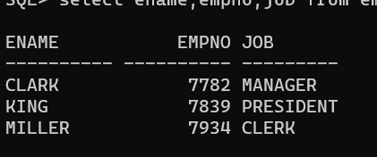
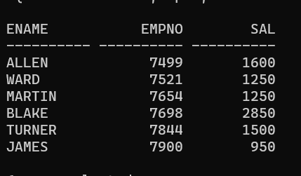
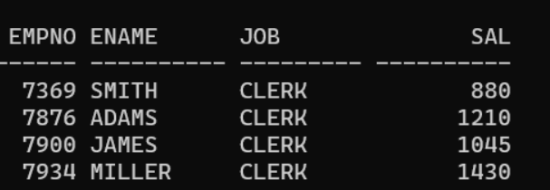
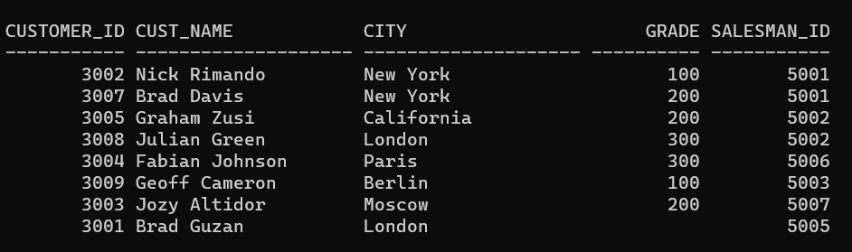
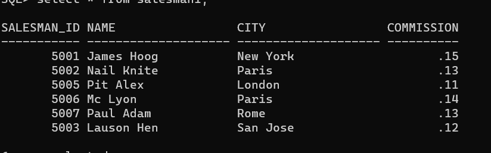
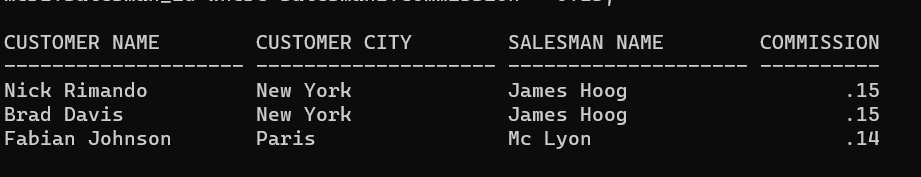
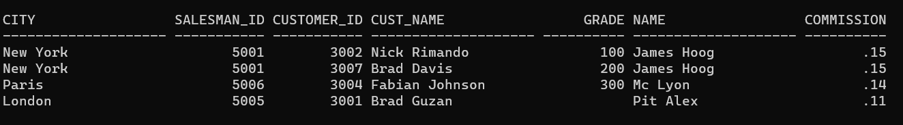
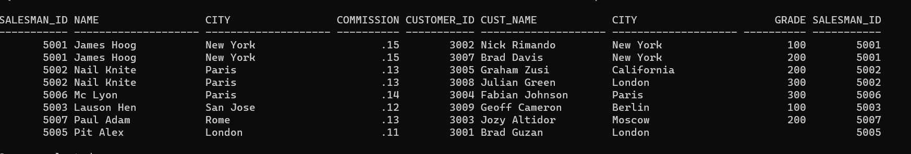
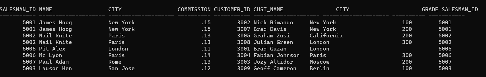

# EX 3 SubQueries, Views and Joins 


## Create employee Table
```sql
CREATE TABLE EMP (EMPNO NUMBER(4) PRIMARY KEY,ENAME VARCHAR2(10),JOB VARCHAR2(9),MGR NUMBER(4),HIREDATE DATE,SAL NUMBER(7,2),COMM NUMBER(7,2),DEPTNO NUMBER(2));
```
## Insert the values
```sql
INSERT INTO EMPN (EMPNO, ENAME, JOB, MGR, HIREDATE, SAL, COMM, DEPTNO)
VALUES (7369, 'SMITH', 'CLERK', 7902, '17-DEC-80', 800, NULL, 20);

INSERT INTO EMPN (EMPNO, ENAME, JOB, MGR, HIREDATE, SAL, COMM, DEPTNO)
VALUES (7499, 'ALLEN', 'SALESMAN', 7698, '20-FEB-81', 1600, 300, 30);

INSERT INTO EMPN (EMPNO, ENAME, JOB, MGR, HIREDATE, SAL, COMM, DEPTNO)
VALUES (7521, 'WARD', 'SALESMAN', 7698, '22-FEB-81', 1250, 500, 30);

INSERT INTO EMPN (EMPNO, ENAME, JOB, MGR, HIREDATE, SAL, COMM, DEPTNO)
VALUES (7566, 'JONES', 'MANAGER', 7839, '02-APR-81', 2975, NULL, 20);

INSERT INTO EMPN (EMPNO, ENAME, JOB, MGR, HIREDATE, SAL, COMM, DEPTNO)
VALUES (7654, 'MARTIN', 'SALESMAN', 7698, '28-SEP-81', 1250, 1400, 30);

INSERT INTO EMPN (EMPNO, ENAME, JOB, MGR, HIREDATE, SAL, COMM, DEPTNO)
VALUES (7698, 'BLAKE', 'MANAGER', 7839, '01-MAY-81', 2850, NULL, 30);

INSERT INTO EMPN (EMPNO, ENAME, JOB, MGR, HIREDATE, SAL, COMM, DEPTNO)
VALUES (7782, 'CLARK', 'MANAGER', 7839, '09-JUN-81', 2450, NULL, 10);

INSERT INTO EMPN (EMPNO, ENAME, JOB, MGR, HIREDATE, SAL, COMM, DEPTNO)
VALUES (7788, 'SCOTT', 'ANALYST', 7566, '19-APR-87', 3000, NULL, 20);

INSERT INTO EMPN (EMPNO, ENAME, JOB, MGR, HIREDATE, SAL, COMM, DEPTNO)
VALUES (7839, 'KING', 'PRESIDENT', NULL, '17-NOV-81', 5000, NULL, 10);

INSERT INTO EMPN (EMPNO, ENAME, JOB, MGR, HIREDATE, SAL, COMM, DEPTNO)
VALUES (7844, 'TURNER', 'SALESMAN', 7698, '08-SEP-81', 1500, 0, 30);

INSERT INTO EMPN (EMPNO, ENAME, JOB, MGR, HIREDATE, SAL, COMM, DEPTNO)
VALUES (7876, 'ADAMS', 'CLERK', 7788, '23-MAY-87', 1100, NULL, 20);

INSERT EMPN (EMPNO, ENAME, JOB, MGR, HIREDATE, SAL, COMM, DEPTNO)
VALUES (7900, 'JAINSERTMES', 'CLERK', 7698, '03-DEC-81', 950, NULL, 30);

INSERT INTO EMPN (EMPNO, ENAME, JOB, MGR, HIREDATE, SAL, COMM, DEPTNO)
VALUES (7902, 'FORD', 'ANALYST', 7566, TO_DATE('03-DEC-81', 'DD-MON-RR'), 3000, 20, 20);

INSERT INTO EMPN (EMPNO, ENAME, JOB, MGR, HIREDATE, SAL, COMM, DEPTNO)
VALUES (7934, 'MILLER', 'CLERK', 7782, TO_DATE('23-JAN-82', 'DD-MON-RR'), 1300, 10, 10);
```
## Output:


## Create department table
```sql
CREATE TABLE DEPT (DEPTNO NUMBER(2) PRIMARY KEY,DNAME VARCHAR2(14),LOC VARCHAR2(13));
```
## Insert the values in the department table
```sql
INSERT INTO DEPT (DEPTNO, DNAME, LOC) VALUES (10, 'ACCOUNTING', 'NEW YORK');

INSERT INTO DEPT (DEPTNO, DNAME, LOC) VALUES (20, 'RESEARCH', 'DALLAS');

INSERT INTO DEPT (DEPTNO, DNAME, LOC) VALUES (30, 'SALES', 'CHICAGO');

INSERT INTO DEPT (DEPTNO, DNAME, LOC) VALUES (40, 'OPERATIONS', 'BOSTON');
```

## Output:

### Q1) List the name of the employees whose salary is greater than that of employee with empno 7566.


### QUERY:
```
select ename from empn where sal>(select sal from empn where empno=7566);
```


### OUTPUT:


### Q2) List the ename,job,sal of the employee who get minimum salary in the company.

### QUERY:
```
select ename,job,sal from empn where sal=(select min(sal) from empn);
```

### OUTPUT:


### Q3) List ename, job of the employees who work in deptno 10 and his/her job is any one of the job in the department ‘SALES’.

### QUERY:
SELECT ENAME, JOB FROM EMPN WHERE DEPTNO = 10 AND JOB IN (SELECT JOB FROM EMPN WHERE JOB='SALESMAN');

### OUTPUT:


### Q4) Create a view empv5 (for the table emp) that contains empno, ename, job of the employees who work in dept 10.

### QUERY:
```
create view emv5 as select empno,ename,job from empn where deptno=10;
select ename,empno,job from emv5;
```

### OUTPUT:


### Q5) Create a view with column aliases empv30 that contains empno, ename, sal of the employees who work in dept 30. Also display the contents of the view.


### QUERY:
```
create view empv30 as select empno,ename,sal from empn where deptno=30;
select ename,empno,sal from empv30;
```

### OUTPUT:


### Q6) Update the view empv5 by increasing 10% salary of the employees who work as ‘CLERK’. Also confirm the modifications in emp table

### QUERY:
```
update empv5 set sal=sal+(sal*0.1) where job='clerk';
```


### OUTPUT:


## Create a Customer1 Table
```
CREATE TABLE Customer1 (customer_id INT,cust_name VARCHAR(20),city VARCHAR(20),grade INT,salesman_id INT);
```
## Inserting Values to the Table
```
INSERT INTO Customer1 (customer_id, cust_name, city, grade, salesman_id) VALUES(3002, 'Nick Rimando', 'New York', 100, 5001);
INSERT INTO Customer1 (customer_id, cust_name, city, grade, salesman_id) VALUES(3007, 'Brad Davis', 'New York', 200, 5001);
INSERT INTO Customer1 (customer_id, cust_name, city, grade, salesman_id) VALUES(3005, 'Graham Zusi', 'California', 200, 5002);
INSERT INTO Customer1 (customer_id, cust_name, city, grade, salesman_id) VALUES(3008, 'Julian Green', 'London', 300, 5002);
INSERT INTO Customer1 (customer_id, cust_name, city, grade, salesman_id) VALUES(3004, 'Fabian Johnson', 'Paris', 300, 5006);
INSERT INTO Customer1 (customer_id, cust_name, city, grade, salesman_id) VALUES(3009, 'Geoff Cameron', 'Berlin', 100, 5003);
INSERT INTO Customer1 (customer_id, cust_name, city, grade, salesman_id) VALUES(3003, 'Jozy Altidor', 'Moscow', 200, 5007);
INSERT INTO Customer1 (customer_id, cust_name, city, grade, salesman_id) VALUES(3001, 'Brad Guzan', 'London', NULL, 5005);

```
## Output:



## Create a Salesperson1 table
```
CREATE TABLE Salesman1 (salesman_id INT,name VARCHAR(20),city VARCHAR(20),commission DECIMAL(4,2));
```
## Inserting Values to the Table
```
INSERT INTO Salesman1 (salesman_id, name, city, commission) VALUES(5001, 'James Hoog', 'New York', 0.15);
INSERT INTO Salesman1 (salesman_id, name, city, commission) VALUES(5002, 'Nail Knite', 'Paris', 0.13);
INSERT INTO Salesman1 (salesman_id, name, city, commission) VALUES(5005, 'Pit Alex', 'London', 0.11);
INSERT INTO Salesman1 (salesman_id, name, city, commission) VALUES(5006, 'Mc Lyon', 'Paris', 0.14);
INSERT INTO Salesman1 (salesman_id, name, city, commission) VALUES(5007, 'Paul Adam', 'Rome', 0.13);
INSERT INTO Salesman1 (salesman_id, name, city, commission) VALUES(5003, 'Lauson Hen', 'San Jose', 0.12);
```
## Output:

### Q7) Write a SQL query to find the salesperson and customer who reside in the same city. Return Salesman, cust_name and city.

### QUERY:
```
SELECT salesman1.name AS "salesman",customer1.cust_name AS "customername", customer1.city FROM salesman1,customer1 WHERE salesman1.city=customer1.city;
```

### OUTPUT:

### Q8) Write a SQL query to find salespeople who received commissions of more than 13 percent from the company. Return Customer Name, customer city, Salesman, commission.


### QUERY:
```
select customer1.cust_name as "CUSTOMER NAME" , customer1.city as "CUSTOMER CITY" , salesman1.name as "SALESMAN NAME" , salesman1.commission as "COMMISSION" from salesman1 INNER JOIN customer1 on salesman1.salesman_id=customer1.salesman_id where salesman1.commission > 0.13;
```


### OUTPUT:

### Q9) Perform Natural join on both tables

### QUERY:
 select * from customer1 NATURAL JOIN salesman1;

### OUTPUT:

### Q10) Perform Left and right join on both tables
## QUERY FOR LEFT JOIN:
```
select * from salesman1 LEFT JOIN customer1 on salesman1.salesman_id=customer1.salesman_id;
```
### Output:

## QUERY FOR RIGHT JOIN:
```
select * from salesman1 RIGHT JOIN customer1 on salesman1.salesman_id=customer1.salesman_id;
```

### OUTPUT:


### Result:
The program has been executed successfully for the above queries.
